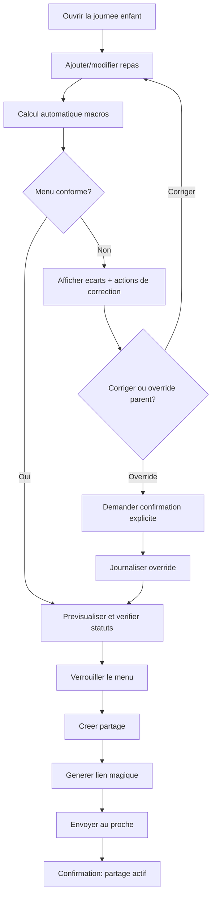
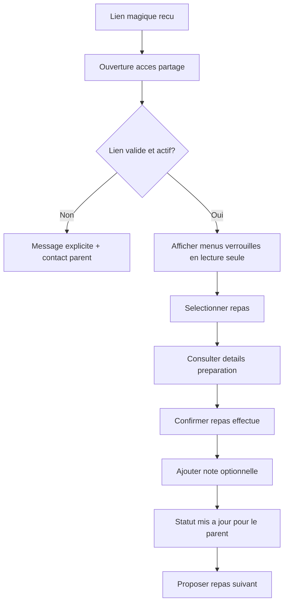
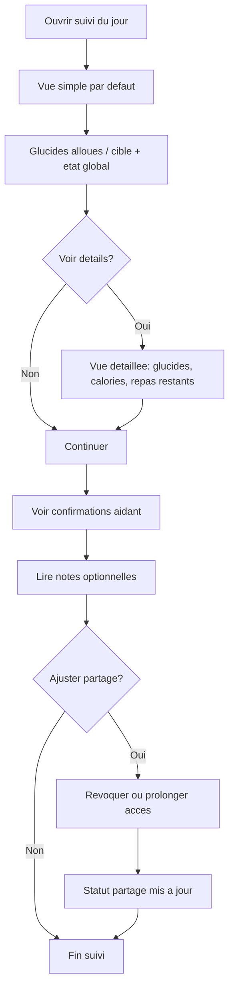

# UX Design Specification kalculo

**Author:** Johann
**Date:** 2026-02-21

---

<!-- UX design content will be appended sequentially through collaborative workflow steps -->

## Executive Summary

### Project Vision

Kalculo is a mobile-first web application designed to make strict therapeutic diet execution safer and easier for families.
It addresses a high-friction, safety-critical workflow where parents currently must inspect product labels or CIQUAL-like databases, then manually compute meal nutrition values under time pressure.
The product's core value is trusted delegation: parents can lock validated menus and share them with caregivers in a bounded, read-only access window, reducing stress while preserving macro reliability and responsibility boundaries.

### Target Users

Primary users are young parents who are comfortable with smartphone/tablet apps and who coordinate strict therapeutic diet planning for a child.
Secondary execution users are family caregivers, often grandparents, who are less digitally fluent and need a simple, low-risk experience to prepare meals correctly.
The product is used mostly on phone and tablet, often in anticipation (planned ahead), but must also support urgent meal creation scenarios.

### Key Design Challenges

1. Reducing high cognitive load in nutrition workflow: users currently gather nutrition data from labels/databases and perform manual calculations, which is slow and error-prone.
2. Building confidence for less tech-savvy caregivers: the experience must be clear, guided, and resistant to mistakes, especially around read-only execution.
3. Supporting both planned and urgent usage modes: UX must work for anticipatory weekly planning and fast emergency meal preparation without compromising reliability.

### Design Opportunities

1. Create a "confidence-first" UX through strong validation feedback, explicit compliant/non-compliant states, and lock-before-share safeguards.
2. Differentiate with caregiver-safe delegation patterns: bounded sharing windows, ultra-clear execution views, and lightweight checklist confirmation.
3. Use role-adaptive UX: richer parent planning tools and simplified caregiver surfaces optimized for rapid understanding on mobile/tablet.

## Core User Experience

### Defining Experience

The core experience of Kalculo is the parent planning loop: create a meal plan, validate macro compliance, and lock it for safe execution.
This loop is the product's primary value engine and must be reliable under everyday time pressure.
The most critical interaction to get right is menu locking: lock state must be explicit, trustworthy, and unambiguous, because it marks the transition from draft planning to governed execution.

### Platform Strategy

Kalculo is a mobile-first web app designed for phone and tablet as primary devices.
Interaction is predominantly touch-based and optimized for kitchen contexts, with short, focused task flows.
For MVP, offline mode is not required; the product assumes online usage with responsive, fast interactions in normal conditions.

### Effortless Interactions

The top priority effortless interaction is food entry with automatic macro computation.
Users should be able to add food items and immediately see updated nutritional totals and compliance impact without manual calculation steps.
The interaction model should minimize cognitive overhead through clear progressive guidance, immediate feedback, and simple correction paths when a plan is non-compliant.

### Critical Success Moments

The key success moment is when parents see completed meal confirmations from caregivers after delegation, creating tangible trust and peace of mind.
First-time success depends on quickly building and locking a compliant menu without confusion.
The make-or-break flow is the full path from planning to locking: if locking feels unreliable or unclear, user trust in the product collapses.

### Experience Principles

1. **Plan-to-Lock Trust:** Every core flow reinforces confidence that locked menus are accurate and safe to execute.
2. **Calculation Without Burden:** Macro totals and compliance status update automatically so users never rely on manual arithmetic.
3. **Touch-First Clarity:** Mobile/tablet interactions prioritize readability, large targets, and low-friction progression.
4. **Delegation Confidence Loop:** Parent trust increases when caregiver execution is simple and confirmations are visible at the right moment.

## Desired Emotional Response

### Primary Emotional Goals

The primary emotional goal for Kalculo is trust and safety.
Users should feel that the product is a reliable safeguard for a high-stakes daily routine, especially when delegating child meal execution to caregivers.
Kalculo should reduce fear of mistakes by making compliance status and decision points explicit.

### Emotional Journey Mapping

- **Discovery / onboarding:** users should feel reassured that Kalculo understands a sensitive, real-world family problem.
- **Core planning loop (create, validate, lock):** users should feel in control and progressively more confident as the interface confirms each step.
- **Post-task (locked menu + caregiver sharing):** users should feel safe and protected, knowing the handoff is governed and reliable.
- **Error or non-compliance moments:** users should immediately understand what happened and what to do next, without panic or ambiguity.
- **Return usage:** users should feel recurring trust, with a stable sense that the app consistently helps them avoid critical mistakes.

### Micro-Emotions

The priority micro-emotion is **confidence**.
Secondary supporting states include reassurance and clarity, but confidence remains the core emotional signal that drives retention and recommendation.
Confidence must be maintained for both user profiles: digitally fluent parents and less tech-savvy caregivers.

### Design Implications

- **Trust/Safety -> UX approach:** explicit compliant/non-compliant states, visible lock state, and clear responsibility boundaries throughout parent and caregiver flows.
- **Recommendation emotion ("I can delegate without fear") -> UX approach:** bounded sharing flows, read-only caregiver interfaces, and clear status of active/expired access windows.
- **Confidence during failures -> UX approach:** immediate, plain-language feedback that explains the issue and gives direct recovery actions.
- **Post-success safety feeling -> UX approach:** strong completion feedback after lock/share plus visible caregiver confirmations when meals are executed.

### Emotional Design Principles

1. **Confidence by Default:** Every critical action should increase user confidence rather than requiring interpretation.
2. **Safety Is Visible:** Compliance, lock status, and sharing boundaries must always be explicit and easy to verify.
3. **Calm Recovery:** When problems occur, the interface explains clearly and guides correction without emotional overload.
4. **Delegation Without Fear:** The product should continuously reinforce that safe handoff is possible and controlled.

## UX Pattern Analysis & Inspiration

### Inspiring Products Analysis

**Facebook**
- Strength in familiarity and adoption: users already know the interaction model, especially around groups and community support.
- Relevant signal for Kalculo: parent support groups show that peer reassurance and practical exchange are central in this domain.
- UX lesson: reduce learning friction by using recognizable mobile patterns and clear, predictable navigation.

**Petit Bambou**
- Strength in emotional tone: calm, reassuring, and non-stressful experience design.
- Relevant signal for Kalculo: a serenity-oriented tone can reduce anxiety in a high-stakes caregiving workflow.
- UX lesson: use gentle language, clear progression, and low-cognitive-load interfaces to support confidence.

### Transferable UX Patterns

- **Familiar mobile navigation patterns** from mainstream apps can reduce onboarding effort, especially for mixed digital literacy audiences.
- **Community-inspired reassurance signals** (without building full social features) can be adapted through trust cues, clear statuses, and supportive microcopy.
- **Calm visual tone and copywriting** from wellness apps can support the product's emotional objective: confidence and safety.
- **Step-by-step progression with explicit feedback** can reinforce understanding during critical actions (validation, lock, sharing).

### Anti-Patterns to Avoid

- Overloaded feeds or noisy layouts that increase cognitive load in already stressful moments.
- Ambiguous status communication (unclear compliant/locked/shared states).
- Alert-heavy or alarming language that amplifies anxiety during correction flows.
- Complex navigation depth that penalizes less tech-savvy caregivers.

### Design Inspiration Strategy

**What to Adopt**
- Familiar, predictable mobile interaction patterns to minimize learning effort.
- Calm, reassuring tone in microcopy and visual rhythm to support emotional safety.
- Clear status-first UX for critical states (compliant, non-compliant, locked, shared, expired).

**What to Adapt**
- Community reassurance as product trust signals (not social feed mechanics).
- Zen tone adapted to healthcare safety context: calm but explicit, never vague.

**What to Avoid**
- Engagement-driven UX patterns that distract from safety-critical tasks.
- Any UI ambiguity in critical actions or state transitions.

## Design System Foundation

### 1.1 Design System Choice

**Approach retained: a custom-first design system based on SCSS, with Bulma as an optional accelerator at start (non-blocking).**

Kalculo adopts a visual and component foundation oriented toward brand uniqueness, compatible with a calm and reassuring tone, without reliance on Tailwind.
The technical base prioritizes proprietary tokens and domain components, with optional selective use of Bulma at startup to accelerate structural patterns.

### Rationale for Selection

- **Product priority: visual uniqueness** over raw development speed, aligned with confidence and serenity goals in a sensitive context.
- **Desired high customization level:** needed to express safety, clarity, and calm emotional posture with precision.
- **Explicit technical constraint:** Tailwind is excluded.
- **Medium team maintenance capacity:** a progressive custom approach is safer than a rigid, highly opinionated framework.
- **Strong alignment with historical style references** (mobile identity, zen tone, purple-first direction).

### Implementation Approach

1. Define a **design token foundation** in SCSS (color, typography, spacing, radius, elevation, state).
2. Build a **priority MVP component layer** (Button, Input, Select, Card, StatusBadge, BottomNav, Stepper, Alert, Modal).
3. Set up modular CSS architecture (for example ITCSS with light BEM and centralized token variables).
4. Use Bulma only when useful for structural acceleration, then progressively replace or encapsulate with Kalculo-native components.
5. Enforce accessibility and state consistency rules (compliant/non-compliant, locked/shared/expired) from first components onward.

### Customization Strategy

- **Brand system:** modernized purple-primary palette, calm neutrals, explicit and unambiguous status colors.
- **Voice and tone in UI:** reassuring, explicit, non-alarmist microcopy with immediate comprehension priority.
- **Role-adaptive components:** richer parent surfaces (planning/control) and simplified caregiver surfaces (read/execute).
- **State-first UX:** components centered on critical statuses (validation, locking, sharing) to reinforce trust.
- **Scalability:** document each MVP component (usage, variants, states, do/don't) to prevent visual drift.

## 2. Core User Experience

### 2.1 Defining Experience

Kalculo's defining experience is enabling parents to create compliant menus easily and share them confidently with relatives who care for their child during holiday periods or other handoff windows.
If this interaction is seamless, the product's core promise is fulfilled: safe delegation without losing nutritional control.

### 2.2 User Mental Model

Parents primarily think in terms of day-level meal planning and final control before delegation.
Their mental model is: prepare the day, check allocation status (especially carbohydrates), confirm compliance, then share with confidence.
The experience should mirror this model directly rather than forcing users into technical nutrition workflows first.

### 2.3 Success Criteria

Users feel "this just works" when:
1. Creating a meal is quick and straightforward.
2. Sharing menus with relatives is simple and unambiguous.
3. Relatives can retrieve and follow shared menus without confusion.

Additional confidence indicator:
- The system provides a clear day completion/allocation view (for example, how many carbohydrates are already allocated), reinforcing control and serenity.

### 2.4 Novel UX Patterns

Kalculo should rely mainly on established UX patterns to minimize learning effort and maximize trust in a sensitive context.
Innovation should come from combining familiar flows (planning, validation, sharing, status tracking) into a safety-first delegation loop tailored to therapeutic diet execution.
The unique twist is not interaction novelty, but confidence orchestration across parent planning and caregiver handoff.

### 2.5 Experience Mechanics

**1. Initiation**
Parent starts by creating/selecting a child nutrition profile (with support for multiple children/profiles in the same family), then opens day planning.

**2. Interaction**
Parent adds meals, sees macro allocation evolve, validates compliance, and prepares the menu for sharing.

**3. Feedback**
System continuously shows clear status and progress signals, including day-level completion/allocation (e.g., carbohydrates already allocated), plus explicit compliant/non-compliant and lock/share readiness states.

**4. Completion**
Parent locks and shares the finalized menu; success is confirmed by clear handoff state and easy caregiver retrieval flow, producing a strong feeling of serenity and control.

## Visual Design Foundation

### Color System

Kalculo uses a calm, trust-oriented palette built around a purple primary accent with neutral grayscale support and white backgrounds.

**Core palette direction**
- Primary brand color: purple (used for key actions, headings, and high-importance status cues).
- Neutral system: layered grays for text, borders, and secondary UI.
- Backgrounds: predominantly white or very light neutral surfaces to preserve clarity and breathing room.
- Accent usage rule: purple is reserved for primary actions and key emphasis to avoid visual overload.

**Semantic color mapping (initial)**
- Primary: brand purple
- Secondary: neutral gray
- Success: soft green (compliance confirmed)
- Warning: amber/orange (attention required)
- Error: red (blocking issue)
- Info: cool blue (neutral guidance)

### Typography System

Typography should feel modern, clear, and reassuring, with slight contrast between hierarchy levels.

**Font strategy**
- Heading font: `Poppins` (friendly, modern, strong visual identity)
- Body/UI font: `Inter` (high readability for forms, labels, and dense operational content)
- Fallbacks: `system-ui, -apple-system, Segoe UI, Roboto, Arial, sans-serif`

**Hierarchy approach**
- Distinct heading levels for fast scanability on mobile.
- Body text optimized for instruction clarity in stressful contexts.
- Labels and helper text remain legible with strong contrast and stable spacing.

### Spacing & Layout Foundation

The layout should "breathe" while staying operationally efficient on mobile/tablet.

**Layout principles**
1. Airy composition with clear vertical rhythm (avoid crowded screens).
2. Full-width form controls for fast touch interaction.
3. Rounded components (buttons/inputs/cards) aligned with the soft, reassuring visual tone.
4. Touch-first sizing for controls and tap targets.
5. Strong state visibility (compliant/non-compliant, locked/shared/expired) without clutter.

**Component-level direction**
- Inputs and primary buttons use full available width on mobile.
- Inputs with floating/overlapping labels (label crossing the border and masking it) are part of the visual language.
- Border radius is a consistent system token across forms and actions.
- Spacing scale should be consistent (8px-based recommended) to maintain rhythm and readability.

### Accessibility Considerations

- Ensure WCAG 2.1 AA contrast for text and critical UI states.
- Do not rely on color alone for compliance/error/status communication.
- Keep touch targets large enough for mobile accessibility.
- Maintain clear focus states for keyboard and assistive navigation.
- Preserve readable text sizes and adequate line height, especially in form-heavy flows.
- Use calm but explicit error copy to guide correction without increasing anxiety.

## Design Direction Decision

### Design Directions Explored

We explored multiple visual directions across layout density, hierarchy, status visibility, and interaction tone.
The selected path combines:
- **Direction 3** as the base (guided, structured, reassuring flow),
- **Direction 2** for operational efficiency and faster parent execution,
- **Direction 1 input style** for form clarity (floating/overlapping labels above bordered fields).

### Chosen Direction

**Chosen direction: Hybrid 3 + 2 + input style from 1**

- Base visual and narrative structure from Direction 3 (step-oriented, clear progression).
- Information density and execution speed inspired by Direction 2 (more actionable data in fewer screens for parents).
- Form fields using Direction 1 label treatment (label crossing/masking border), aligned with preferred UI language from historical mockups.

### Design Rationale

This hybrid direction best supports Kalculo's core experience:
- It preserves a reassuring, guided feeling for safety-critical tasks.
- It improves day-to-day efficiency for frequent parent workflows.
- It keeps forms familiar, legible, and calm through the preferred floating-label pattern.
- It balances trust, speed, and usability for mixed digital literacy users (parents vs caregivers).

### Implementation Approach

1. Use Direction 3 as the primary screen composition model.
2. Apply Direction 2 density rules on parent operational screens (planning/validation/lock/share).
3. Standardize all text inputs with Direction 1 floating-label style.
4. Keep status-first cues explicit (compliant/non-compliant, locked/shared/expired).
5. Validate this hybrid with quick prototype checks on:
   - parent quick planning flow,
   - caregiver read/execute flow,
   - form-heavy screens (profile/payment/settings).

## User Journey Flows

### Parent Flow - Plan, Validate, Lock, Share

Objectif: permettre au parent de passer rapidement d'un brouillon a un menu partageable, avec controle explicite et option d'override en cas de non-conformite.

### Caregiver Flow - Access, Read, Execute, Confirm

Objectif: un parcours simple pour un aidant moins technophile, en lecture seule, avec confirmation par repas + note optionnelle.

### Parent Follow-up Flow - Day Progress, Caregiver Tracking, Access Control

Objectif: donner au parent une vision simple par defaut, avec detail a la demande, et pilotage de l'acces.

### Journey Patterns

- **Navigation patterns**
  - Progression guidee en etapes avec CTA principal unique.
  - Retour contexte jour/enfant toujours visible.

- **Decision patterns**
  - Decisions critiques explicites (conformite, verrouillage, partage).
  - Option d'override parent encadree par confirmation + journalisation.

- **Feedback patterns**
  - Statuts visibles et persistants (`conforme/non conforme`, `verrouille`, `partage`, `actif/expire`).
  - Progression simple par defaut + detail au tap.

### Flow Optimization Principles

- Minimiser le nombre d'etapes vers la valeur (planifier -> verrouiller -> partager).
- Reduire la charge cognitive avec affichage progressif (simple puis detaille).
- Donner un feedback immediat a chaque action critique.
- Prevoir des chemins de recuperation clairs en cas d'erreur/lien invalide/non-conformite.
- Preserver la serenite via un ton rassurant et des confirmations explicites.

## Component Strategy

### Design System Components

**Base retenue:** Bulma pour la structure/layout + composants metier custom pour les interactions critiques.

**Couverture via Bulma (ou equivalent structurel)**
- Grille et conteneurs responsives mobile/tablette
- Espacements de base et helpers d'alignement
- Blocs structurels simples (cards, sections, stacks, split rows)
- Boutons et champs de base comme point de depart visuel (fortement styles via SCSS)

**Composants a garder custom (metier Kalculo)**
- Tous les composants lies a la securite nutritionnelle, au verrouillage, au partage aidant, et au multi-profil enfant.
- Tous les composants necessitant des etats metier specifiques (`conforme/non conforme`, `verrouille/partage/expire`, progression macro).

### Custom Components

### MacroProgressRing

**Purpose:** Afficher la progression journaliere des glucides alloues vs cible de facon immediate.
**Usage:** En haut des ecrans parent (planification/suivi jour).
**Anatomy:** anneau de progression + valeur actuelle + cible + etat (ok/attention).
**States:** default, proche limite, depassement, donnees incompletes.
**Variants:** compact (header), detaille (ecran suivi).
**Accessibility:** valeur textuelle obligatoire (pas uniquement visuel), contraste AA, libelles explicites pour lecteur d'ecran.
**Content Guidelines:** toujours afficher unite (`g`) et ratio (`x/y`).
**Interaction Behavior:** tap ouvre le detail des allocations par repas.

### ShareLinkPanel

**Purpose:** Creer, afficher et gerer le lien magique de partage aidant.
**Usage:** Apres verrouillage, dans le flow parent "share".
**Anatomy:** etat du partage, lien/code, actions (copier, revoquer, prolonger).
**States:** non configure, actif, expire, revoque, erreur generation.
**Variants:** inline (dans flow), full panel (ecran gestion partage).
**Accessibility:** actions clavier, feedback non ambigu apres copie/revocation, messages d'erreur lisibles.
**Content Guidelines:** inclure fenetre temporelle, statut d'acces et rappel "lecture seule".
**Interaction Behavior:** action critique confirmee (revocation/prolongation) avec retour d'etat immediat.

### ChildProfileSwitcher

**Purpose:** Permettre de basculer rapidement entre plusieurs profils enfants.
**Usage:** Header parent sur ecrans planification/suivi.
**Anatomy:** avatar/nom enfant + menu de selection + action "ajouter profil".
**States:** profil unique, multi-profils, profil incomplet, chargement, erreur sync.
**Variants:** compact (barre haute), liste detaillee (ecran profils).
**Accessibility:** navigation clavier, nom de profil annonce, focus visible.
**Content Guidelines:** toujours montrer le profil actif pour eviter les erreurs de contexte.
**Interaction Behavior:** changement de profil met a jour immediatement le contexte jour + indicateurs macro.

### Component Implementation Strategy

- Approche pragmatique orientee composants metier directs (peu de couches abstraites initiales).
- Utiliser Bulma uniquement comme fondation structurelle; surcouche SCSS Kalculo pour l'identite visuelle.
- Standardiser des conventions d'etat pour tous les composants critiques (`default`, `loading`, `success`, `warning`, `error`, `disabled`).
- Appliquer l'accessibilite en priorite sur flows critiques (AA), avec extension progressive au reste.
- Encapsuler les composants metier dans un dossier unique design-system interne pour eviter la dispersion.

### Implementation Roadmap

**Phase 1 - Core (priorite parent planning/lock/share)**
1. `ChildProfileSwitcher` (contexte enfant sur des l'entree)
2. `MacroProgressRing` (feedback immediat sur allocation journaliere)
3. `ShareLinkPanel` (handoff aidant securise)

**Phase 2 - Supporting**
- Harmonisation champs/formulaires flottants (style direction 1)
- Etats visuels standardises des CTA et statuts critiques
- Normalisation des patterns de confirmation/recuperation erreur

**Phase 3 - Enhancement**
- Variantes avancees de visualisation progression macro
- Instrumentation UX (temps de tache, erreurs, abandon de flow)
- Durcissement accessibilite sur composants secondaires

## UX Consistency Patterns

### Button Hierarchy

- Two visible CTAs can coexist on a screen when needed:
  - one clear primary action (brand emphasis),
  - one secondary action (outline or lower visual weight).
- Avoid tertiary action overload in critical flows.
- On mobile, CTA labels must be explicit and action-oriented (no ambiguous wording).
- In safety-critical steps (validation, lock, share), confirm destructive or high-impact actions.

### Feedback Patterns

- Status communication relies primarily on **single, compact badges** for key domain states:
  - `conforme` / `non conforme`
  - `brouillon` / `verrouille`
  - `partage actif` / `expire` / `revoque`
- Badge wording must be short, stable, and reused consistently across screens.
- Badge color mapping is semantic but should remain restrained to avoid visual noise.
- For high-risk contexts, badges can be complemented by nearby contextual text only when needed.

### Form Patterns

- Validation occurs primarily on submit for consistency and reduced distraction.
- Critical fields can still show minimal pre-submit hints when input is clearly invalid.
- Form controls are full-width on mobile, with rounded borders and floating/overlapping labels.
- Error messages are explicit, calm, and corrective (what happened + what to do next).
- Keep grouped fields visually close to reduce cognitive switching.

### Navigation Patterns

- Use a mixed navigation model:
  - **Parent:** bottom navigation for frequent operational sections.
  - **Caregiver:** guided, linear task flows for read/execute simplicity.
- Preserve visible context at all times (active child profile, current day/flow stage).
- Keep top-level destinations stable to reduce relearning.
- In guided flows, always provide a clear "next step" and clear completion feedback.

### Additional Patterns

- **Loading states:** pedagogical loading messages when operation context matters (validation/share), not just spinners.
- **Empty states:** explicit next-step guidance with one clear CTA.
- **Error states:** readable explanations + recovery path + optional fallback action.
- **State transitions:** always explicit when moving to lock/share/expiry states.
- **Accessibility baseline:** mobile-first tap sizing, strong contrast, and non-color-only meaning for critical outcomes.

## Responsive Design & Accessibility

### Responsive Strategy

Kalculo targets a near-parity experience across mobile, tablet, and desktop for MVP, while preserving mobile-first interaction principles.
The product should feel consistent across devices, with the same core flows and status logic, adapted to available space.

- **Mobile:** primary operational context, touch-first, concise hierarchy, strong action clarity.
- **Tablet:** same interaction model as mobile, with slightly more breathing room and improved readability.
- **Desktop:** near-parity flow support with spatial adaptation (wider layouts where useful), without introducing divergent product logic.

### Breakpoint Strategy

Adopt standard breakpoints plus one custom intermediate breakpoint to better control larger phones/small tablets.

- Mobile: `320px - 767px`
- Tablet: `768px - 1023px`
- Desktop: `1024px+`
- Custom intermediate breakpoint: around `900px` for layout rebalancing on edge tablet/small desktop contexts.

Implementation principle:
- mobile-first CSS architecture,
- progressive enhancement at each breakpoint,
- avoid behavior divergence between device classes.

### Accessibility Strategy

Target compliance level:
- **WCAG AA on critical user flows for MVP**, with progressive extension to remaining surfaces.

Critical flows in scope:
- parent planning/validation/lock/share,
- caregiver access/read/confirm,
- status visibility and recovery paths.

Core requirements:
- semantic structure and screen reader-compatible labels,
- consistent focus visibility,
- accessible error messaging with corrective guidance,
- non-color-only communication for critical states.

### Testing Strategy

Prioritized MVP accessibility tests:

1. **Keyboard-only navigation** on critical flows (focus order, actionable controls, modal handling).
2. **Color contrast and color-vision checks** for status communication and form feedback.

Responsive and cross-device tests:
- real-device checks on representative smartphones/tablets/desktops,
- key browser matrix validation (Chrome/Safari/Firefox/Edge),
- orientation and viewport stress checks for form-heavy screens.

### Implementation Guidelines

**Responsive development**
- Build mobile-first, then enhance at tablet/desktop breakpoints.
- Keep flow logic identical across devices; adapt layout, not behavior.
- Use relative sizing and fluid spacing with tokenized SCSS variables.
- Preserve full-width controls where they improve touch accuracy.

**Accessibility development**
- Ensure all critical actions are keyboard reachable and clearly focused.
- Pair badges/status colors with explicit text labels.
- Maintain minimum touch targets and readable typography scales.
- Standardize accessible form patterns (floating labels + clear error/help text).
- Add accessibility acceptance criteria to component definitions and PR reviews.
